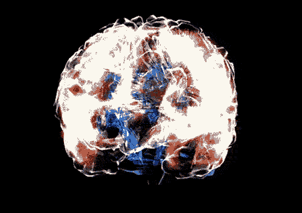

# Brain Weight in Humans
<h3> Variations of head sizes and brain weights in humans </h3>
<h4> Kaggle dataset obtained from <a href="https://www.kaggle.com/anubhabswain/brain-weight-in-humans">this link</a> 
by <a href="https://www.kaggle.com/anubhabswain">Anubhab Swain</a>.</h3>

<h6 align="center">Image obtained from <a href="https://giphy.com/butler/">Matthew Butler.</a></h6>
  
### Models implemented by <a href="https://github.com/AnneLivia">Anne Livia</a>.

### Context

This dataset was compiled using a medical study conducted on a group of people.

### Content:

This dataset shows a few variations of head sizes and masses of brains, it also consists additional gender and age group columns.

- **Gender**: 1 for Male, 2 for Female
- **Age Range**: 1 represents > 18 years of age, 2 represents < 18 years of age
- **Head Size(cm^3)**: Head volume in cubic centimetres
- **Brain Weight(grams)**: - Mass of brains in grams

### Question to be answered:

Predict the masses of the brains using the data, and later compare it with the actual masses of brains mentioned in the dataset.

# Software Information

  - Python
  - Pandas
  - Scikit-learn
  - Matplotlib
  - Seaborn

# Trained Models 
  - Linear Regression
  - Multi-layer Perceptron
  - Decision Tree
